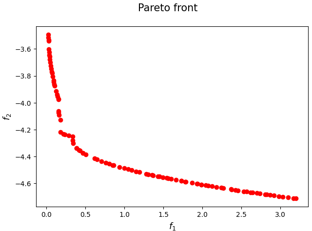
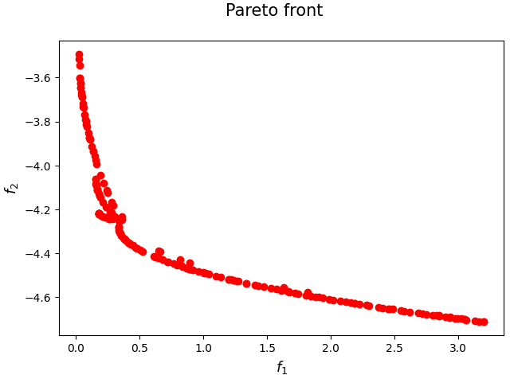

[](https://www.python.org/downloads/release/python-3106/)
[](https://opensource.org/licenses/Apache-2.0)

<p>
  
   
</p>

# On the Computation of the Efficient Frontier in Advanced Portfolio Optimization

Implementation of the Multi-Objective methodologies for advanced portoflio optimization presented in

[Annunziata A. and Lapucci M. and Mansueto P. and Pucci D. - On the Computation of the Efficient Frontier in Advanced Portfolio Optimization]()

In case you employ this code for research purposes, please cite:

```
@misc{
    TODO
}
```

## Installation

To run the code, a working [Anaconda](https://www.anaconda.com/) installation is required. We recommend creating a new conda environment with ```Python 3.10.6``` or above.
Required dependencies can be installed using:
```
pip install -r requirements.txt
```
Note that the dependency `nsma` will also install `gurobipy` as [Gurobi](https://www.gurobi.com/) is used to solve direction subproblems. Make sure a valid licence is available.

## Datasets
The code is provided with a toy dataset. As for the datasets tested in the paper, some of them can be downloaded from [francescocesarone.com/data-sets](https://www.francescocesarone.com/data-sets), while others can be provided upon request.

## Usage
In order to run the experiments, execute the following:
```
python main.py [options]
```
specifying the required options:

<div align='center'>
  
| Option                   | Type        | Description                                                                    | Default           |
|--------------------------|-------------|--------------------------------------------------------------------------------|-------------------|
| `--single_point_methods` | `list[str]` | List of phase 1 methods to be tested (`MOHyb`, `Gurobi`, `NG2`, `NS`, `MOSPD`) | None (required)   |
| `--max_t_p1`             | `float`     | Time limit for phase 1 methods (expressed in minutes)                          | None (required)   |
| `--max_t_p2`             | `float`     | Time limit for phase 2 methods (expressed in minutes)                          | None (required)   |
| `--objectives`           | `list[str]` | List of objectives (`Variance`, `Mean`, `SR`, `ESG`, `Skew`)                   | None (required)   |
| `--prob_path`            | `str`       | Problem path                                                                   | None (required)   |
| `--s`                    | `int`       | Upper Bound for the Solution Cardinality                                       | None (required)   |

</div>

Other useful optional parameters are:

<div align='center'>

| Option                      | Type         | Description                                                          | Default            |
|-----------------------------|--------------|----------------------------------------------------------------------|--------------------|
| `--plot_pareto_front`       | `bool`       | Plot Pareto front during the execution                               | `False`            |
| `--general_export`          | `bool`       | Export fronts (including plots), execution times and arguments files | `False`            |
| `--export_pareto_solutions` | `bool`       | Export pareto solutions to file                                      | `False`            |
| `--beta_bounds`             | `[str, str]` | Bounds for beta                                                      | `['None', 'None']` |

</div>

The full list of parameters is available in `parser_management.py`, containing also the settings for each algorithm, for the line-search and for Gurobi.

An example usage is:
```
python main.py --single_point_methods NS --NS_local_opt MOIHT --max_t_p1 2 --max_t_p2 2 \
               --prob_path datasets/TOY1 --objectives Variance Mean  --s 2 \
               --plot_pareto_front --general_export --export_pareto_solutions
```

## Contact

[Davide Pucci](https://webgol.dinfo.unifi.it/davide-pucci/), [Pierluigi Mansueto](https://webgol.dinfo.unifi.it/pierluigi-mansueto/) <br>
Global Optimization Laboratory ([GOL](https://webgol.dinfo.unifi.it/))<br>
University of Florence<br>
Email: davide dot pucci at unifi dot it, pierluigi dot mansueto at unifi dot it